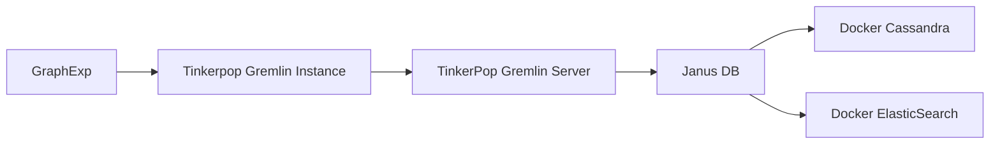

# Visualisation of a JanusGraph

## Goal

The goal of this project is to find a convenient and easy way to visualise a graph stored in JanusGraph/Cassandra DB. 
This visualisation must be automatic and rendered on a webpage. Using tools such as Cytoscape / Cytoscape.js is a good solution to create and arrange graphs, however it is impossible to generate automatically a Cytoscape.js graph.
 
 
## Architecture

The following diagram represent the interactions between the different layers of this project



### Cassandra

[Cassandra](http://cassandra.apache.org/) is an open source, distributed NoSQL database that natively integrates with JanusGraph, serving as a data storage backend

### JanusGraph

[JanusGraph](janusgraph.org) is a TinkerPop-compatible graph database that allows the storage (here on cassandra) of a table representing vertexes and edges, with each of them having various properties that allows the representation of data 
as a graph model rather than in the traditional relational bases. 

### Tinkerpop/Gremlin

[TinkerPop](tinkerpop.apache.org) is an open source graph computing framework used in graph databases and graph analytic systems. The TinkerPop Framwork uses the **Gremlin** query language.
```
// What are the names of Gremlin's friends' friends?
    g.V().has("name","gremlin").
      out("knows").out("knows").values("name")
```

The components used here are:

* The Gremlin console, that is used to load the initial graph into the database
* The Gremlin server, with the JanusGraph plugin, that opens a connection with the Cassandra database and allows the GraphExp and gremlin server to access it.

### GraphExp

[GraphExp](https://github.com/bricaud/graphexp) Graphexp is a lightweight web interface to explore and display a graph stored in a Gremlin graph database, via the Gremlin server.

GraphExp uses 3d.js to represent the graphs contained in the database. Various queries can be made to get specific information about an edge/vertex and provide an easy way to navigate in a graph.
## Usage

### launch Cassandra 
```
docker run --name jg-cassandra -d -e CASSANDRA_START_RPC=true -p 9160:9160 -p 9042:9042 -p 7199:7199 -p 7001:7001 -p 7000:7000 cassandra:3.11
```

### launch ElasticSearch
```
docker run --name es -d -p 9200:9200 -p 9300:9300 elasticsearch:5.6
```
To verify that ElasticSearch was correctly launched, verify that the following command  ``` curl localhost:9200 ```
returns the following string
```
{
  "name" : "9XjBwtd",
  "cluster_name" : "elasticsearch",
  "cluster_uuid" : "Qt6r2smoSGuXo0PLB_Bfvg",
  "version" : {
    "number" : "5.6.8",
    "build_hash" : "688ecce",
    "build_date" : "2018-02-16T16:46:30.010Z",
    "build_snapshot" : false,
    "lucene_version" : "6.6.1"
  },
  "tagline" : "You Know, for Search"
}
```
If the docker container fails on startup, verify that you've allocated enough memory, as described [here](https://github.com/10up/wp-local-docker/issues/6)

### Load the graph example in the database

The first step is to launch the gremlin server. For this, we can ```cd``` into the janusgraph repository and launch ```gremlin-server.sh``` with the proper configuration 
```
$ bin/gremlin-server.sh conf/gremlin-server/gremlin-server.yaml
```

**NOTE:** the previous commands can be simplified by running the ```bin/janushgraph.sh start``` executable, but it is then impossible to dissociate the cassandra and elasticsearch services from janus.

Then, we just need to launch a gremlin terminal. For this, we can ```cd``` into the janusgraph repository and launch ```gremlin.sh```
```
$ bin/gremlin.sh
```

Once in, let's connect to our gremlin server and load the graph with
```
$ :remote connect tinkerpop.server conf/remote.yaml session
$ :remote console
$ graph=graph.io(graphml()).readGraph('tmp/air-routes.graphml')
```
The graph is composed of thousands of vertexes and edges, and can then take several seconds to load. If a timeout exit error occurs, the timeout limit can be increased by modifying the ```scriptEvaluationTimeout``` value in the ```conf/gremlin-server/gremlin-server-configuration.yaml```

Once the graph has been loaded into memory, we can visualize it on graphExp. For this, let's launch a simple webserver
```
$ cd graphexp
$ python -m SimpleHTTPServer 1337
```
Navigating into ```http://0.0.0.0:1337``` will great you with the GraphExp interface.